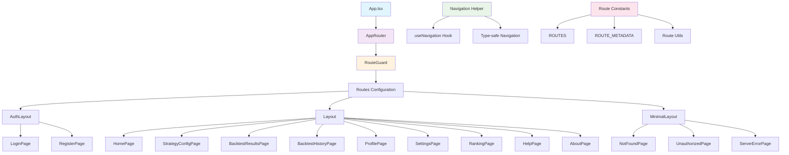

# 路由系统架构图

## 系统架构概览

以下是项目路由系统的整体架构图，展示了各个组件之间的关系和数据流向：

## 架构说明

### 核心层级

1. **应用入口 (App.tsx)**
   - 项目的根组件，负责初始化路由系统

2. **路由器 (AppRouter)**
   - 路由系统的核心组件
   - 管理全局路由配置和懒加载

3. **路由守卫 (RouteGuard)**
   - 处理认证和权限控制
   - 自动重定向未授权访问

4. **路由配置 (Routes Configuration)**
   - 统一管理所有路由定义
   - 支持多种布局模式

### 布局系统

- **AuthLayout**: 认证相关页面的专用布局
- **Layout**: 主应用页面的标准布局
- **MinimalLayout**: 错误页面的简化布局

### 页面组件

按功能分类的页面组件：
- **认证页面**: 登录、注册
- **功能页面**: 首页、策略配置、回测结果等
- **错误页面**: 404、401、500

### 工具系统

- **Navigation Helper**: 提供类型安全的导航方法
- **Route Constants**: 路由常量和元数据管理
- **Route Utils**: 路由相关的工具函数

## 数据流向

1. **用户访问** → **路由守卫检查** → **布局选择** → **页面渲染**
2. **导航操作** → **Navigation Helper** → **路由跳转**
3. **权限控制** → **RouteGuard** → **重定向或允许访问**

## 优势特点

- **模块化设计**: 每个功能独立，易于维护
- **类型安全**: 完整的TypeScript支持
- **懒加载**: 按需加载页面组件
- **权限控制**: 自动化的路由守卫
- **可扩展**: 易于添加新功能和页面 